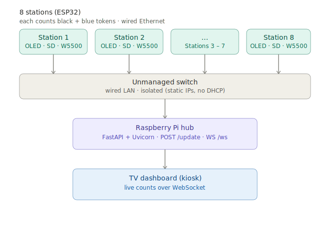

# ESP32 Token Counter

An 8-station interactive token-counting installation built for a live event. Each
station counts tokens dropped through two chutes, shows a live count on an OLED,
persists every count to an SD card, and reports over wired Ethernet to a Raspberry
Pi hub. A live dashboard on a TV shows all eight stations updating in real time.

This is a **sanitized reference version** of a system that ran unattended for four
days at a venue. Client branding, network addresses, admin routes, and event-specific
assets have been removed. The interesting engineering — SPI bus separation, pulsed IR
detection, and crash-safe counting — is preserved.



## How it works

Each station is an ESP32 with:

- Two IR sensor chutes, one per token colour (black and blue)
- An SSD1306 OLED showing the live count
- A microSD card for local, power-loss-safe storage
- A W5500 module for wired Ethernet

Stations POST their absolute counts to a Raspberry Pi hub running FastAPI. The hub
serves a dashboard over WebSockets, so every drop shows up on the TV within a moment.
Wired Ethernet was chosen over WiFi because each station already needs a power cable
run to it — one more cable buys a far more reliable link in a crowded RF environment.

## What made it reliable

The whole brief was *unattended reliability* — four days at a venue where I couldn't
step in to fix anything. A few decisions that mattered more than any single clever fix:

### SPI bus separation

A cheap SD adapter was silently disabling the Ethernet module. It didn't tri-state
its MISO line when deselected, so it clamped the shared SPI bus and the W5500 read as
absent. The fix was to give each device its own bus: the W5500 on VSPI, the SD card on
a dedicated HSPI instance. A "faulty" part that was never faulty.

### Pulsed IR detection, not a continuous carrier

The IR receivers have automatic gain control that suppresses a continuous 38kHz
carrier — the beam reads as permanently absent within a second or two. The working
approach is short pulsed bursts with a recovery gap between reads, polled in the main
loop. Continuous carrier and interrupt-driven reads both failed for different reasons;
pulsed polling was the only reliable method.

### One emitter part across all units

The build started with two different IR emitter modules that needed different supply
rails. Rather than keep debugging the mismatch, I standardised the whole build on the
one that runs cleanly on 3.3V — eight identical stations, no per-unit rail surprises.

### Crash-safe counting

Counts are flushed to the SD card on every single token, not batched. On boot, a
station restores its last known count (from the hub first, then the SD card, then
zero). Stations report *absolute* counts rather than increments, so a dropped network
packet self-corrects on the very next POST instead of losing a count forever.

## A bug that looked like a code bug

The SD cards arrived as 64GB instead of the 16GB ordered. 64GB cards default to exFAT,
which the ESP32 `SD.h` library can't mount — so the firmware looked broken when the
real problem was a supply substitution. Cards need to be **32GB or smaller** and
formatted **FAT32**.

## Repo layout

```
firmware/   ESP32 sketch — single-station reference (Arduino)
hub/        Raspberry Pi hub — minimal FastAPI + WebSocket example
docs/       Topology diagram and wiring notes
```

## Hardware

| Part | Notes |
|------|-------|
| ESP32 dev board | 38-pin NodeMCU-style, USB-C |
| W5500 Ethernet module | On VSPI |
| microSD adapter | 5V level-shifting; on a dedicated HSPI bus |
| microSD card | ≤32GB, FAT32 |
| SSD1306 OLED | 128×64, I2C @ 0x3C |
| IR emitters + receivers | 38kHz; emitters on 3.3V, receivers on 3.3V |
| Unmanaged switch | Wired LAN between stations and hub |
| Raspberry Pi 4 | Hub — FastAPI, Uvicorn, systemd |

See [`docs/wiring.md`](docs/wiring.md) for pin assignments.

## Notes

This is reference code, not the exact production build. It's meant to show the
architecture and the reliability decisions, not to be flashed as-is. Pin numbers,
timings, and network config are examples — adjust for your own hardware.

## License

MIT — see [LICENSE](LICENSE).
